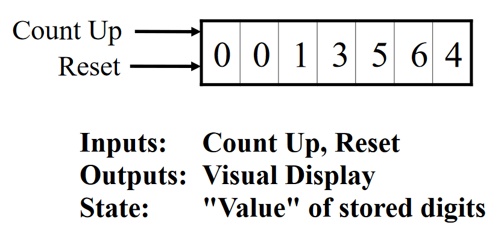
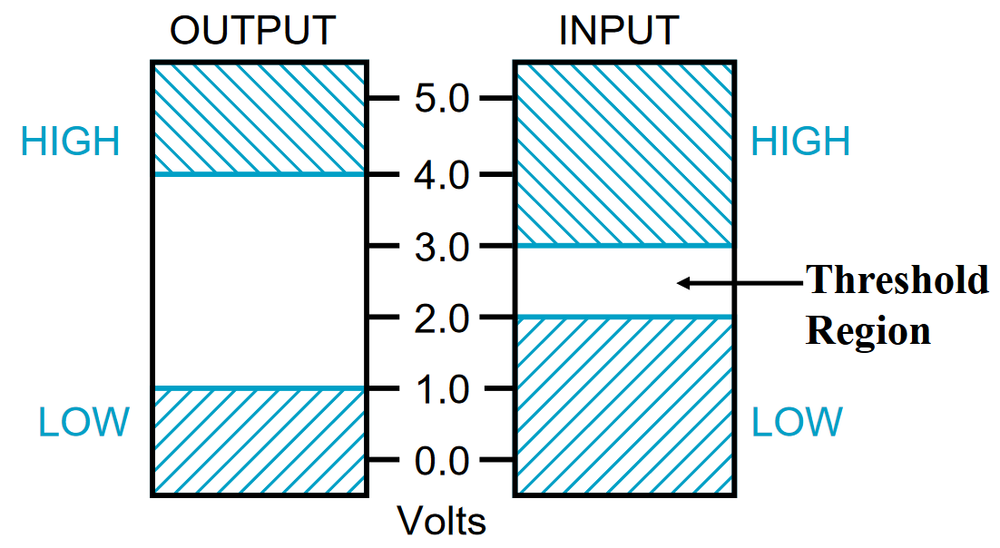
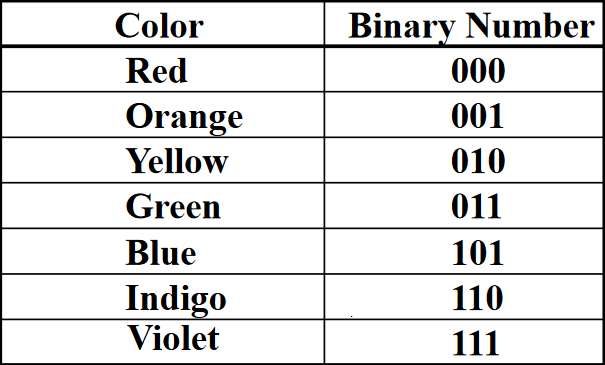

$\pagebreak$

## Course Information

Course Title: CS-370 - Computer Architecture

Professor: Tao Xie ([txie@sdsu.edu](mailto:txie@sdsu.edu))

Office Hours: Friday 1100-1200 or by Zoom appointment.

Textbook: Logic and Computer Fundamentals, 5th ed., Mano/Kime/Martin.

Grading Breakdown:

* 20% Homework
* 25% Lab
* 25% Midterm
* 30% Final
* 0% Weekly Exercises

$\pagebreak$

## Chapter 1 - Digital Computers and Information

### Digital Systems and Computer Systems

Digital systems take a set of discrete information **inputs** and discrete internal information (**system state**) and generates a set of discrete information **outputs** (i.e. the odometer on a car's dashboard).

{width=350px}

Side Note: It is critical to use a cache with a CPU. Memory access is *slow*.

### Signal

An information variable represented by physical quantity is a signal (e.g. voltages and circuits). For digital systems, the variable takes on discrete values. Two level (binary) values are the most prevalent in digital systems.

Abstractly, they can be represented by:

* 0 and 1
* False (F) and True (T)
* Low (L) and High (H)
* On and Off

There are two types of digital signals: asynchronous and synchronous.

**Asynchronous** is discrete in value and continuous in time - it is able to change at any time.

**Synchronous** is discrete in value and time - it is consistent (**sync**hronous!) with the clock on the computer.

**Threshold regions** are important because they define the intermediate area to differentiate high and low value (binary). Output needs to have a larger threshold region than input because signal *always* has more noise than it came with (think operations done on the signal while in the CPU, etc).

{width=350px}

### Number Systems

#### Special Powers of 2

* $2^{10}$ (1024) is Kilo, denoted "K"
* $2^{20}$ (1,048,576) is Mega, denoted "M"
* $2^{30}$ (1,073,741,824) is Giga, denoted "G"

#### Base Conversions

| Decimal ($\text{N}_{10}$) | Binary ($\text{N}_2$)  | Hexadecimal ($\text{N}_{16}$) |
|:-------------------------:|:----------------------:|:-----------------------------:|
|             0             |          0000          |               0               |
|             1             |          0001          |               1               |
|             2             |          0010          |               2               |
|             3             |          0011          |               3               |
|             4             |          0100          |               4               |
|             5             |          0101          |               5               |
|             6             |          0110          |               6               |
|             7             |          0111          |               7               |
|             8             |          1000          |               8               |
|             9             |          1001          |               9               |
|             10            |          1010          |               A               |
|             11            |          1011          |               B               |
|             12            |          1100          |               C               |
|             13            |          1101          |               D               |
|             14            |          1110          |               E               |
|             15            |          1111          |               F               |

Converting decimals to a fractional binary part (like 0.6875 to binary):

* Multiply by 2.
* Take the integer value and place it on the right hand of the equal sign.
  * Subtract 1 if the integer is 1.
* Repeat until remainder is 0.
* Read off in forward direction.

If the binary part does not terminate (like $0.65_{10}$ to $\text{N}_2$), specify the number of bits to the right of radix point and round or truncate the number.

### Binary Numbers and Binary Coding

There are two types of information:

* Numeric
  * Must represent range of data needed
  * Ideal because computation is straightforward, uses common [arithmetic](arithmetic.md)
  * Tight relation to binary numbers

* Non-numeric
  * More flexible, no arithmetic operations
  * Not tied to binary numbers

Following certain constraints, any binary combination (code word) can be assigned to any data as long as data is uniquely encoded. Given $n$ binary digits (bits), a binary code is a mapping from a set of represented elements to a subset of the $2^n$ binary numbers.

{width=350px}

In order to determine the minimum number of bits $n$ needed to represent $M$ elements:

$2^n \geq M > 2^{(n-1)}$; $n = \lceil \log_2 M \rceil$

**Binary Coded Decimal (BCD)** is the simplest, most intuitive binary code for decimal digits. It is the binary representation of decimal numbers but only for decimal values 0-9.

Conversion is **NOT** the same as coding. For example, $13_{10} = 1101$ is conversion and $13 \longleftrightarrow 0001 | 0011$ is coding.
